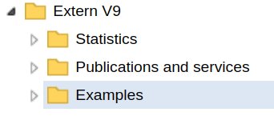
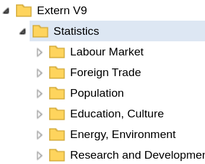
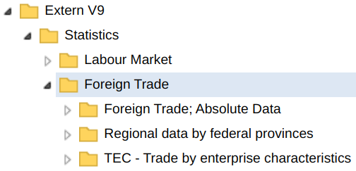
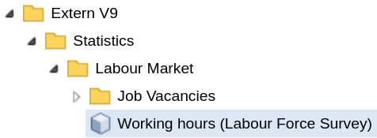
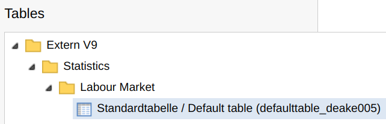
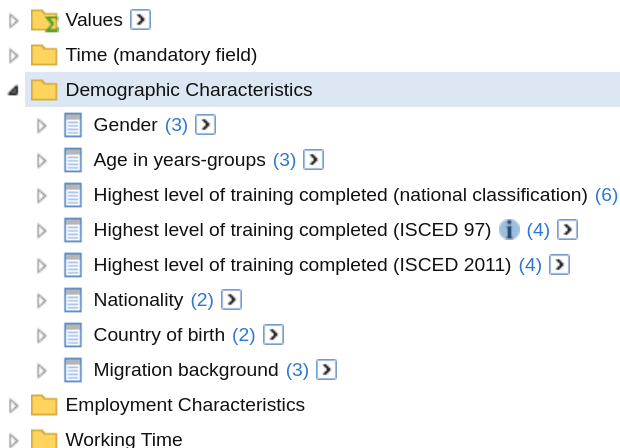

# Get Metadata with the Schema Endpoint

    ## ✔ Key could be verified via a test request

    ## ℹ The provided key will be available for this R session

    ## ℹ Add `STATCUBE_KEY_EXT = XXXX` to "~/.Renviron" to set the key
    ##   persistently. Replace `XXXX` with your key

There are currently three functions in
[STATcubeR](https://statistikat.github.io/STATcubeR/index.md) that
utilize the `/schema` endpoint.

- [`sc_schema_catalogue()`](https://statistikat.github.io/STATcubeR/reference/sc_schema.md)
  returns an overview of all available databases and tables.
- [`sc_schema_db()`](https://statistikat.github.io/STATcubeR/reference/sc_schema.md)
  can be used to inspect all fields and measures for a database.
- [`sc_schema()`](https://statistikat.github.io/STATcubeR/reference/sc_schema.md)
  returns metadata about any resource.

## Browsing the Catalogue

The first function shows the catalog, which lists all available
databases in a tree form. The tree structure is determined by the API
and closely resembles the “Catalog” view in the GUI.

``` r

my_catalogue <- sc_schema_catalogue()
my_catalogue
```

    #> FOLDER: Extern V9
    #>  1 ABS FH NÖ Fachhochschule St. Pölten                 FOLDER     1
    #>  2 ABS FH NÖ Fachhochschule Wiener Neustadt            FOLDER     1
    #>  3 ABS FH NÖ Fachhochschulen Niederösterreich Gesamt   FOLDER     1
    #>  4 ABS FH NÖ Ferdinand Porsche FernFH                  FOLDER     1
    #>  5 ABS FH NÖ IMC Fachhochschule Krems                  FOLDER     1
    #>  6 Temporary Employment                                FOLDER    12
    #>  7 ATRACK Akademie der bildenden Künste Wien           FOLDER     1
    #>  8 ATRACK Alpen-Adria-Universität Klagenfurt           FOLDER     1
    #>  9 ATRACK CAMPUS 02 Fachhochschule der Wirtschaft GmbH FOLDER     1
    #> 10 ATRACK Fachhochschule Burgenland GmbH               FOLDER     1
    #> # ℹ 43 more rows

We see that the catalog has 8 child nodes: Four children of type
`FOLDER` and four children of type `TABLE`. The table nodes correspond
to the saved tables as described in the [saved tables
article](https://statistikat.github.io/STATcubeR/articles/sc_table_saved.md).
The folders include all folders from the root level in the [catalogue
explorer](https://statistikat.github.io/STATcubeR/articles/%60r%20sc_browse_catalogue()%60):
“Statistics”, “Publication and Services” as well as “Examples”.



To get access to the child nodes use `my_catalogue${child_label}`

``` r

my_catalogue$Statistics
```

    #> FOLDER: Statistics
    #> 1 Labour Market       FOLDER    15
    #> 2 Foreign Trade       FOLDER     4
    #> 3 Population          FOLDER    16
    #> 4 Education, Culture  FOLDER     5
    #> 5 Energy, Environment FOLDER     2
    #> # ℹ 15 more rows

The child node `Statistics` is also of class `sc_schema` and shows all
entries of the sub-folder.



This syntax can be used to navigate through folders and sub-folders.

``` r

my_catalogue$Statistics$`Foreign Trade`
```

    #> FOLDER: Foreign Trade
    #> 1 TEC - Trade by enterprise characteristics FOLDER    20
    #> 2 Außenhandelsindizes                       FOLDER     0
    #> 3 Foreign Trade; Absolute Data              FOLDER    12
    #> 4 Regional data by federal provinces        FOLDER     6



In some cases, the API shows more folders than the GUI in which case the
folders from the API will be empty. Seeing an empty folder usually means
that your STATcube user is not permitted to view the contents of the
folder.

``` r

my_catalogue$Statistics$`Foreign Trade`$Außenhandelsindizes
```

    #> FOLDER: Außenhandelsindizes

## Databases and Tables

Inside the catalog, the leafs[^1] of the tree are mostly of type
`DATABASE` and `TABLE`.

``` r

my_catalogue$Statistics$`Foreign Trade`$`Regional data by federal provinces`
```

    #> FOLDER: Regional data by federal provinces
    #> 1 Regional data by federal provinces and 2digits CN         DATABASE
    #> 2 Regional data by federal provinces and countries          DATABASE
    #> 3 Regional data by federal provinces and country groups     DATABASE
    #> 4 Standardtabelle / Default table (defaulttable_deahbdlkn2) TABLE   
    #> 5 Standardtabelle / Default table (defaulttable_deahbdlld)  TABLE   
    #> # ℹ 1 more row

Here is an example for the `DATABASE` node
[`deake005`](https://statistikat.github.io/STATcubeR/articles/%60r%20sc_browse_database(%22deake005%22)%60).

``` r

my_catalogue$Statistics$`Labour Market`$`Working hours (Labour Force Survey)`
```

    #> DATABASE: Working hours (Labour Force Survey)
    #> # Get more metdata with `sc_schema_db('deake005')`



The function
[`sc_schema_db()`](https://statistikat.github.io/STATcubeR/reference/sc_schema.md)
will be shown in the next section. As an example for a `TABLE` node,
consider the [default table for `deake005`](NA).

``` r

my_catalogue$Statistics$`Labour Market`$
  `Standardtabelle / Default table (defaulttable_deake005)`
```

    #> TABLE: Standardtabelle / Default table (defaulttable_deake005)
    #> # Get the data with `sc_table_saved('defaulttable_deake005')`



As suggested by the output, tables can be loaded with the `/table`
endpoint via
[`sc_table_saved()`](https://statistikat.github.io/STATcubeR/reference/sc_table.md).
See the [saved tables
article](https://statistikat.github.io/STATcubeR/articles/sc_table_saved.md)
for more details.

## Database Infos

To get information about a specific database, you can pass the database
`id` to
[`sc_schema_db()`](https://statistikat.github.io/STATcubeR/reference/sc_schema.md).
Similar to
[`sc_schema_catalogue()`](https://statistikat.github.io/STATcubeR/reference/sc_schema.md),
the return value has a tree-like data structure.

``` r

my_db_info <- sc_schema_db("deake005")
my_db_info
```

    #> DATABASE: Working hours (Labour Force Survey)
    #> 1 Factors                     GROUP     9
    #> 2 Datensätze/Records          GROUP     1
    #> 3 Time (mandatory field)      GROUP     1
    #> 4 Demographic Characteristics GROUP     8
    #> 5 Employment Characteristics  GROUP     6
    #> # ℹ 3 more rows

For comparison, here is a screenshot from the sidebar of the table view
for
[`deake005`](https://statistikat.github.io/STATcubeR/articles/%60r%20sc_browse_database(%22deake005%22)%60)
which has a similar (but not identical) structure.



`my_db_info` can be used in a similar fashion as `my_catalogue` to
obtain details about the resources in the tree. For example, the
`VALUESET` with the label “Gender” can be viewed like this.

``` r

my_db_info$`Demographic Characteristics`
```

    #> GROUP: Demographic Characteristics
    #> 1 Gender                                                        FIELD     1
    #> 2 Age in years-groups                                           FIELD     3
    #> 3 Educational attainment – highest complet                      FIELD     2
    #> 4 Educational attainment – highest completed level (ISCED 97)   FIELD     2
    #> 5 Educational attainment – highest completed level (ISCED 2011) FIELD     2
    #> # ℹ 3 more rows

``` r

my_db_info$`Demographic Characteristics`$Gender$Gender
```

    #> VALUESET: Gender
    #> 1 male                 VALUE
    #> 2 female               VALUE
    #> 3 Not classifiable <0> VALUE

``` r

my_db_info$`Demographic Characteristics`$Gender$Gender$male
```

    #> VALUE: male

The leafs of database schemas are mostly of type `VALUE` and `MEASURE`.

## Data Structure of sc_schema Objects

As shown above, `sc_schema` objects have a tree like structure. Each
`sc_schema` object has `id`, `label`, `location` and `type` as the last
four entries

``` r

str(tail(my_db_info$`Demographic Characteristics`, 4))
```

    #> List of 4
    #>  $ id      : chr "str:group:deake005:X_B1"
    #>  $ label   : chr "Demographic Characteristics"
    #>  $ location: chr "http://statcubeapi.statistik.at/statistik.at/ext/statcube/rest/v1/schema/str:group:deake005:X_B1"
    #>  $ type    : chr "GROUP"

``` r

str(tail(my_catalogue$Statistics, 4))
```

    #> List of 4
    #>  $ id      : chr "str:folder:festat"
    #>  $ label   : chr "Statistics"
    #>  $ location: chr "http://statcubeapi.statistik.at/statistik.at/ext/statcube/rest/v1/schema/str:folder:festat"
    #>  $ type    : chr "FOLDER"

Schema objects can have an arbitrary amount of children. Children are
always of type `sc_schema`. `x$type` contains the type of the schema
object. A complete list of schema types is available in the [API
reference](https://docs.wingarc.com.au/superstar/9.12/open-data-api/open-data-api-reference/schema-endpoint).

## Other Resources

Information about resources other than databases and the catalog can be
obtained by passing the resource id to
[`sc_schema()`](https://statistikat.github.io/STATcubeR/reference/sc_schema.md).

``` r

(id <- my_db_info$Factors$id)
#> [1] "str:group:deake005:M_F1"
group_info <- sc_schema(id)
group_info
#> GROUP: Factors
#> 1 Average hours actually worked per week                             MEASURE
#> 2 Average hours usually worked per week                              MEASURE
#> 3 Volume of hours worked in the main job per year in million hours   MEASURE
#> 4 Volume of hours worked overtime (paid) per year in million hours   MEASURE
#> 5 Volume of hours worked overtime (unpaid) per year in million hours MEASURE
#> # ℹ 4 more rows
```

Note that the tree returned only has depth 1, i.e. the child nodes of
measures are not available in `group_info`. However, ids of the child
nodes can be obtained with `$id`. These ids can be used to send another
request to the `/schema` endpoint

``` r

(id <- group_info$`Average hours usually worked per week`$id)
#> [1] "str:measure:deake005:F-DATA:F-FAKTOR2"
measure_info <- sc_schema(id)
```

Alternatively, use the `depth` parameter of
[`sc_schema()`](https://statistikat.github.io/STATcubeR/reference/sc_schema.md).
This will make sure that the entries of the tree are returned
recursively up to a certain level. For example, `depth = "VALUESET"`
will use the same level of recursion as
[`sc_schema_db()`](https://statistikat.github.io/STATcubeR/reference/sc_schema.md).
See
[`?sc_schema`](https://statistikat.github.io/STATcubeR/reference/sc_schema.md)
for all available options of the `depth` parameter.

``` r

group_info <- my_db_info$`Demographic Characteristics`$id %>%
  sc_schema(depth = "valueset")
```

## Printing with data.tree

If the [data.tree](https://github.com/gluc/data.tree) package is
installed, it can be used for an alternative print method.

``` r

print(group_info, tree = TRUE)
```

    #>                           levelName     type
    #> 1  Demographic Characteristics         GROUP
    #> 2   ¦--Gender                          FIELD
    #> 3   ¦   °--Gender                   VALUESET
    #> 4   ¦       ¦--male                    VALUE
    #> 5   ¦       ¦--female                  VALUE
    #> 6   ¦       °--Not classifiable <0>    VALUE
    #> 7   ¦--Age in years-groups             FIELD
    #> 8   ¦   ¦--Age in years-groups      VALUESET
    #> 9   ¦   ¦   ¦--Under 15 years          VALUE
    #> 10  ¦   ¦   ¦--15 to 19 years          VALUE
    #> 11  ¦   ¦   ¦--20 to 24 years          VALUE
    #> 12  ¦   ¦   ¦--25 to 29 years          VALUE
    #> 13  ¦   ¦   ¦--30 to 34 years          VALUE
    #> 14  ¦   ¦   ¦--35 to 39 years          VALUE
    #> 15  ¦   ¦   ¦--40 to 44 years          VALUE
    #> 16  ¦   ¦   ¦--45 to 49 years          VALUE
    #> 17  ¦   ¦   ¦--50 to 54 years          VALUE
    #> 18  ¦   ¦   ¦--55 to 59 years          VALUE
    #> 19  ¦   ¦   ¦--60 to 64 years          VALUE
    #> 20  ¦   ¦   ¦--65 to 69 years          VALUE
    #> 21  ¦   ¦   ¦--70 to 74 years          VALUE
    #> 22  ¦   ¦   ¦--75 years and older      VALUE
    #> 23  ¦   ¦   °--Not classifiable <0>    VALUE
    #> 24  ¦   ¦--Alter in Jahresgruppen   VALUESET
    #> 25  ¦   ¦   ¦--Under 15 years          VALUE
    #> 26  ¦   ¦   ¦--15 to 24 years          VALUE
    #> 27  ¦   ¦   ¦--25 to 34 years          VALUE
    #> 28  ¦   ¦   ¦--35 to 44 years          VALUE
    #> 29  ¦   ¦   ¦--45 to 54 years          VALUE
    #> 30  ¦   ¦   °--... 3 nodes w/ 0 sub         
    #> 31  ¦   °--... 1 nodes w/ 6 sub             
    #> 32  °--... 6 nodes w/ 80 sub

The [data.tree](https://github.com/gluc/data.tree) implementation of the
print method can be set as a default using the option
`STATcubeR.print_tree`

``` r

options(STATcubeR.print_tree = TRUE)
```

## Flatten a Schema

The function
[`sc_schema_flatten()`](https://statistikat.github.io/STATcubeR/reference/sc_schema.md)
can be used to turn responses from the `/schema` endpoint into
`data.frame`s. The following call extracts all databases from the
catalog and displays their ids and labels.

``` r

sc_schema_catalogue() %>%
  sc_schema_flatten("DATABASE")
```

``` r-output
# A data frame: 792 × 2
  id                                       label                                
  <chr>                                    <chr>                                
1 str:database:deaeapp_absfhnoe_stpoelt    AbsolventInnenstudie der NÖ Fachhoch…
2 str:database:deaeapp_absfhnoe_wrneustadt AbsolventInnenstudie der NÖ Fachhoch…
3 str:database:deaeapp_absfhnoe_gesamt     AbsolventInnenstudie der NÖ Fachhoch…
4 str:database:deaeapp_absfhnoe_ferdporsch AbsolventInnenstudie der NÖ Fachhoch…
5 str:database:deaeapp_absfhnoe_imckrems   AbsolventInnenstudie der NÖ Fachhoch…
# ℹ 787 more rows
```

The string `"DATABASE"` in the previous example acts as a filter to make
sure only nodes with the schema type `DATABASE` are included in the
table.

If `"DATABASE"` is replaced with `"TABLE"`, all tables will be
displayed. This includes

- All the default-tables on STATcube. Most databases have an associated
  default table.
- All saved tables for the current user as described in the [saved
  tables
  article](https://statistikat.github.io/STATcubeR/articles/sc_table_saved.md).
- Other saved tables. Some databases do not only provide a default table
  but also several other tables. See [this database on transport
  statistics](https://portal.statistik.at/statistik.at/ext/statcube/openinfopage?id=degvk_fahrt_2010)
  as an example for database with more than one associated table

``` r

sc_schema_catalogue() %>%
  sc_schema_flatten("TABLE")
```

``` r-output
# A data frame: 809 × 2
  id                                         label                              
  <chr>                                      <chr>                              
1 str:table:defaulttable_dekonjunkturmonitor Standardtabelle / Default table (d…
2 str:table:defaulttable_dewatlas1           Standardtabelle / Default table (d…
3 str:table:defaulttable_dewatlas11          Standardtabelle / Default table (d…
4 str:table:defaulttable_dewatlas3           Standardtabelle / Default table (d…
5 str:table:defaulttable_dewatlas4           Standardtabelle / Default table (d…
# ℹ 804 more rows
```

[`sc_schema_flatten()`](https://statistikat.github.io/STATcubeR/reference/sc_schema.md)
can also be used with
[`sc_schema_db()`](https://statistikat.github.io/STATcubeR/reference/sc_schema.md)
and
[`sc_schema()`](https://statistikat.github.io/STATcubeR/reference/sc_schema.md).
The following example shows all available measures from the [economic
trend monitor
database](https://portal.statistik.at/statistik.at/ext/statcube/openinfopage?id=dekonjunkturmonitor).

``` r

sc_schema_db("dekonjunkturmonitor") %>%
  sc_schema_flatten("MEASURE")
```

``` r-output
# A data frame: 88 × 2
  id                                              label                         
  <chr>                                           <chr>                         
1 str:measure:dekonjunkturmonitor:F-DATA:F-FAKT-1 Production index industry (wd…
2 str:measure:dekonjunkturmonitor:F-DATA:F-FAKT-2 Technical total production in…
3 str:measure:dekonjunkturmonitor:F-DATA:F-FAKT-3 Turnover index industry (2021…
4 str:measure:dekonjunkturmonitor:F-DATA:F-FAKT-4 Turnover industry (in 1.000 €)
5 str:measure:dekonjunkturmonitor:F-DATA:F-FAKT-5 Index of new orders industry …
# ℹ 83 more rows
```

## Further Reading

- Schemas can be used to construct table requests as described in the
  [custom tables
  article](https://statistikat.github.io/STATcubeR/articles/sc_table_custom.md)
- See the [saved tables
  article](https://statistikat.github.io/STATcubeR/articles/sc_table_saved.md)
  to get access to the data for table nodes in the schema.

[^1]: In the context of tree-like data structures, leafs are used to
    describe nodes of a tree which have no child nodes
