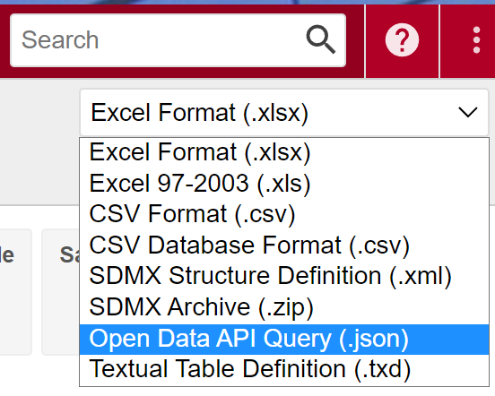

# Get Tables via JSON Requests

    ## ✔ Key could be verified via a test request

    ## ℹ The provided key will be available for this R session

    ## ℹ Add `STATCUBE_KEY_EXT = XXXX` to "~/.Renviron" to set the key
    ##   persistently. Replace `XXXX` with your key

In the following example, a table will be exported from STATcube into an
R session. This process involves four steps

- create a table with the STATcube GUI (table view)
- download an “API request” for the table (format: `*.json`).
- send the `json` file to the API using
  [`sc_table()`](https://statistikat.github.io/STATcubeR/reference/sc_table.md).
- convert the return value into a `data.frame`

It is assumed that you already provided your API key as described in the
[API key
article](https://statistikat.github.io/STATcubeR/articles/sc_key.md).

## Create a table with the STATcube GUI

Use the graphical user interface of STATcube to create a table. Visit
[STATcube](https://www.statistik.at/datenbanken/statcube-statistische-datenbank/login)
and select a database. This will open the table view where you can
create a table. See the [STATcube
documentation](https://www.statistik.at/datenbanken/statcube-statistische-datenbank/dokumente-downloads)
for details.

## Download an API request

Choose “Open Data API Query (.json)” in the [download
options](https://docs.wingarc.com.au/superstar/9.12/superweb2/user-guide/download-tables).
This will save a json file on your local file system.



It might be the case that this download option is not listed as a
download format. This means that the current user is not permitted to
use the API.

## Send the json to the API

Provide the path to the downloaded json file as a string in
[`sc_table()`](https://statistikat.github.io/STATcubeR/reference/sc_table.md).

``` r

library(STATcubeR)
my_table <- sc_table(json = "path/to/api_request.json")
```

This will send the json-request to the [`/table`
endpoint](https://docs.wingarc.com.au/superstar/9.12/open-data-api/open-data-api-reference/table-endpoint)
of the API and return an object of class `sc_table`. We will demonstrate
this with an example json via
[`sc_example()`](https://statistikat.github.io/STATcubeR/reference/sc_table.md).

``` r

(json_path <- sc_example("population_timeseries.json"))
## [1] "~/R/3.6/STATcubeR/json_examples/population_timeseries.json"
my_table <- sc_table(json_path)
```

Printing the object `my_table` will summarize the data contained in the
response.

``` r

my_table
```

    #> Population at the beginning of the quarter since 2002
    #> 
    #> Database: debevstand (STATcube)
    #> Measures: Number of persons
    #> Fields: Quarter <98>, Age in single years <96> <7>, Sex <2> <3>, Commune
    #>   <2383> (Province-District) <10>
    #> 
    #> Request: [2026-10-09 04:58:02]
    #> STATcubeR: 1.0.1

## Convert the response into a data frame

The return value of
[`sc_table()`](https://statistikat.github.io/STATcubeR/reference/sc_table.md)
can be converted into a `data.frame` with
[`as.data.frame()`](https://rdrr.io/r/base/as.data.frame.html).

``` r

as.data.frame(my_table)
```

``` r-output
# A STATcubeR tibble: 20,580 x 5
   Quarter    `Age in single years <96>` `Sex <2>` Commune <2383> (Province-Di…¹
   <date>     <fct>                      <fct>     <fct>                        
 1 2002-01-01 Up to 14 years old         male      Burgenland <AT11>            
 2 2002-01-01 Up to 14 years old         male      Carinthia <AT21>             
 3 2002-01-01 Up to 14 years old         male      Vienna <AT13>                
 4 2002-01-01 Up to 14 years old         male      Vorarlberg <AT34>            
 5 2002-01-01 Up to 14 years old         male      Tyrol <AT33>                 
 6 2002-01-01 Up to 14 years old         male      Styria <AT22>                
 7 2002-01-01 Up to 14 years old         male      Salzburg <AT32>              
 8 2002-01-01 Up to 14 years old         male      Upper Austria <AT31>         
 9 2002-01-01 Up to 14 years old         male      Lower Austria <AT12>         
10 2002-01-01 Up to 14 years old         male      Total                        
# ℹ 20,570 more rows
# ℹ abbreviated name: ¹​`Commune <2383> (Province-District)`
# ℹ 1 more variable: `Number of persons` <int>
```

This will produce a `data.frame`, which contains a column for each
classification field of the table. Furthermore, one column will be
present for each measure. In other words, the data uses a long format.
If you prefer to use codes rather than labels, use `my_table$data`
instead.

``` r

my_table$data
```

``` r-output
# A STATcubeR tibble: 20,580 x 5
   `C-A10-0` `C-BESC51-0` `C-BESC11-0` `C-C41-2` `F-ISIS-1`
   <fct>     <fct>        <fct>        <fct>          <int>
 1 A10-20021 BESN07-1     1            B00-1          21287
 2 A10-20021 BESN07-1     1            B00-2          47230
 3 A10-20021 BESN07-1     1            B00-9         117920
 4 A10-20021 BESN07-1     1            B00-8          34798
 5 A10-20021 BESN07-1     1            B00-7          62794
 6 A10-20021 BESN07-1     1            B00-6          97538
 7 A10-20021 BESN07-1     1            B00-5          46955
 8 A10-20021 BESN07-1     1            B00-4         127316
 9 A10-20021 BESN07-1     1            B00-3         133928
10 A10-20021 BESN07-1     1            SC_TOTAL      689766
# ℹ 20,570 more rows
```

## Example datasets

This article used a dataset about the Austrian population via
[`sc_example()`](https://statistikat.github.io/STATcubeR/reference/sc_table.md).
[STATcubeR](https://statistikat.github.io/STATcubeR/index.md) contains
more example jsons to get started. The datasets can be listed with
[`sc_examples_list()`](https://statistikat.github.io/STATcubeR/reference/sc_table.md).

- Accommodation
- STATatlas
- Trade
- GDP
- Working Hours
- Agriculture
- monitor.statistik.at

``` r

sc_example("accomodation.json") %>% sc_table()
```

``` r

sc_example("economic_atlas.json") %>% sc_table()
```

``` r

sc_example("foreign_trade.json") %>% sc_table()
```

``` r

sc_example("gross_regional_product.json") %>% sc_table()
```

``` r

sc_example("labor_force_survey.json") %>% sc_table()
```

`{r, eval = FALSE sc_example("agriculture_prices.json") %>% sc_table()`

``` r

sc_example("economic_trend_monitor.json") %>% sc_table()
```

## Choosing the Language

The language which is used for labeling can be changed via the
`language` parameter of
[`sc_table()`](https://statistikat.github.io/STATcubeR/reference/sc_table.md).

- Accommodation
- STATatlas
- Trade
- GDP
- Working Hours
- Agriculture
- monitor.statistik.at

``` r

sc_example("accomodation.json") %>% sc_table("de")
```

    #> Nächtigungsstatistik ab 2000 nach Tourismusregionen und Saison
    #> 
    #> Database: detouextregiosai (STATcube)
    #> Measures: Übernachtungen, Ankünfte
    #> Fields: Saison / Tourismusmonat <323>, Herkunftsland <4>,
    #>   Beherbergungsbetrieb <4>
    #> 
    #> Request: [2026-10-09 04:58:04]
    #> STATcubeR: 1.0.1

``` r

sc_example("economic_atlas.json") %>% sc_table("de")
```

    #> 02 Eckdaten Bundesländer
    #> 
    #> Database: dewatlas2 (STATcube)
    #> Measures: Arbeitslosenquote - ILO, Erwerbstätigenquote (15-64 J.) - ILO,
    #>   Nächtigungen, Durchschnittliche Aufenthaltsdauer in Tagen,
    #>   Privathaushalte, Fläche (km²), Wohnbevölkerung im Jahresdurchschnitt,
    #>   Forschungsquote (in % des BIP), Erwerbstätige - ILO, Arbeitslose - ILO, …
    #>   (38 more)
    #> Fields: Jahr (ab 1995) <27>, Bundesland <11>
    #> 
    #> Request: [2026-10-09 04:58:10]
    #> STATcubeR: 1.0.1

``` r

sc_example("foreign_trade.json") %>% sc_table("de")
```

    #> Außenhandel nach Gütern (CPA) und Wirtschaftszweig (NACE)
    #> 
    #> Database: denatec06 (STATcube)
    #> Measures: Import; Anzahl der Unternehmen, Import, Wert in Euro, Export;
    #>   Anzahl der Unternehmen, Export, Wert in Euro
    #> Fields: Güter (CPA) <4>, Berichtsjahr <18>, Wirtschaftszweig (NACE) [teilw.
    #>   ABO] <4>
    #> 
    #> Request: [2026-10-09 04:58:19]
    #> STATcubeR: 1.0.1

``` r

sc_example("gross_regional_product.json") %>% sc_table("de")
```

    #> Bruttoregionalprodukt nach ESVG 1995, NUTS2+NUTS3 - abgeschlossene
    #> Zeitreihe
    #> 
    #> Database: devgrrgr004 (STATcube)
    #> Measures: Bruttoregionalprodukt nominell in Mio.Euro, Bruttoregionalprodukt
    #>   je Einwohner, Bruttoregionalprodukt je Erwerbstätigem
    #> Fields: NUTS-3 <11>, Zeit <13>
    #> 
    #> Request: [2026-10-09 04:58:23]
    #> STATcubeR: 1.0.1

``` r

sc_example("labor_force_survey.json") %>% sc_table("de")
```

    #> Mikrozensus-Arbeitskräfteerhebung Arbeitsstunden
    #> 
    #> Database: deake005 (STATcube)
    #> Measures: Durchschn. tatsächlich geleistete Arbeitsstunden pro Woche,
    #>   Durchschn. Normalarbeitsstunden pro Woche
    #> Fields: Zeit <12>, Geschlecht <3>, Höchste abgeschlossene Bildung -
    #>   nationale Gliederung <6>, Bundesland (NUTS 2-Einheit) <10>
    #> 
    #> Request: [2026-10-09 04:58:38]
    #> STATcubeR: 1.0.1

``` r

sc_example("agriculture_prices.json") %>% sc_table("de")
```

    #> LGR01_Landwirtschaftliche Gesamtrechnung zu laufenden Preisen in
    #> Millionen Euro
    #> 
    #> Database: delgr001 (STATcube)
    #> Measures: Werte (für Positionen der Produktion sowie Wertschöpfung: Werte zu
    #>   Herstellungspreisen), Gütersteuern (für Positionen der Produktion), Werte
    #>   zu Erzeugerpreisen (für Positionen der Produktion), Gütersubventionen (für
    #>   Positionen der Produktion)
    #> Fields: Jahr <32>, Position <6>
    #> 
    #> Request: [2026-10-09 04:58:43]
    #> STATcubeR: 1.0.1

``` r

sc_example("economic_trend_monitor.json") %>% sc_table("de")
```

    #> Konjunkturmonitor
    #> 
    #> Database: dekonjunkturmonitor (STATcube)
    #> Measures: Produktionsindex Industrie (at; 2021=100), Technische
    #>   Gesamtproduktion Industrie in Tsd. € (KJE), Umsatzindex Industrie
    #>   (2021=100), Umsatz Industrie inTsd.€ (KJE), Auftragseingangsindex
    #>   Industrie (2021=100), Beschäftigtenindex Industrie (2021=100),
    #>   Beschäftigte Industrie gesamt (KJE), Produktionsindex Industrie je
    #>   unselbständig Beschäftigtem (2021=100), Produktionsindex Industrie je
    #>   geleisteter Arbeitsstunde (2021=100), Erzeugerpreisindex für den
    #>   Produzierenden Bereich (2021=100; NACE B-E), … (53 more)
    #> Fields: Berichtszeitraum <214>, Wertangabe <2>
    #> 
    #> Request: [2026-10-09 04:58:48]
    #> STATcubeR: 1.0.1

## Further reading

- The functionality of the returned object are explained in the
  [STATcubeR data
  article](https://statistikat.github.io/STATcubeR/articles/sc_data.md).
- [`sc_tabulate()`](https://statistikat.github.io/STATcubeR/reference/sc_tabulate.md)
  provides a more flexible way of turning STATcube tables into
  `data.frame`s. See the [tabulation
  article](https://statistikat.github.io/STATcubeR/articles/sc_tabulate.md)
  for more details.
- The [saved tables
  article](https://statistikat.github.io/STATcubeR/articles/sc_table_saved.md)
  shows an alternative way of importing tables.
- If you are interested in other API endpoints, see the [schema
  article](https://statistikat.github.io/STATcubeR/articles/sc_schema.md)
  or the [other API endpoints
  article](https://statistikat.github.io/STATcubeR/articles/sc_info.md)
