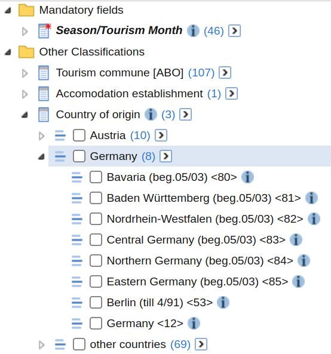

# Define Custom Tables

    ## ✔ Key could be verified via a test request

    ## ℹ The provided key will be available for this R session

    ## ℹ Add `STATCUBE_KEY_EXT = XXXX` to "~/.Renviron" to set the key
    ##   persistently. Replace `XXXX` with your key

The function
[`sc_table_custom()`](https://statistikat.github.io/STATcubeR/reference/sc_table_custom.md)
allows you to define requests against the `/table` endpoint
programmatically. This can be useful to automate the generation of
`/table` request rather than relying on the GUI to do so. The function
accepts the four arguments.

- A **database** id
- ids of **measures** to be imported (type `MEASURE`, `STAT_FUNCTION` or
  `COUNT`)
- ids of **fields** to be imported (type `FIELD` or `VALUESET`)
- a list of **recodes** that can be used customize fields

## Building a Custom Table Step by Step

The first part of this Article will showcase how custom tables can be
created with a [database about
tourism](https://portal.statistik.at/statistik.at/ext/statcube/openinfopage?id=detouextregiosai).
This database will also be used in most other examples of this article.

### Starting Simple

First, we want to just send the database id to
[`sc_table_custom()`](https://statistikat.github.io/STATcubeR/reference/sc_table_custom.md).
This will request only the mandatory fields and default measures for
that database. In case of the tourism database, a table with one single
row is returned.

``` r

database <- "str:database:detouextregiosai"
x <- sc_table_custom(database)
x$tabulate()
```

``` r-output
# A STATcubeR tibble: 1 x 2
  `Season/Tourism Month` `Nights spent`
* <date>                          <int>
1 2026-06-01                   63421969
```

Show json request

``` r

x$json
```

``` json
 {
  "database": "str:database:detouextregiosai",
  "measures": [],
  "dimensions": []
} 
```

We see that 63 421 969 nights were spent in Austrian tourism
establishments in the month of 2026-06-01.

### Adding Countries

Now we want to add a classification to the table. This can be done by
getting the database schema and showing all classification fields.

``` r

tourism <- sc_schema_db(database)
(fields <- sc_schema_flatten(tourism, "FIELD"))
```

``` r-output
# A data frame: 4 × 2
  id                                             label                     
  <chr>                                          <chr>                     
1 str:field:detouextregiosai:F-DATA1:C-SDB_TIT-0 Season/Tourism Month      
2 str:field:detouextregiosai:F-DATA:C-GEMREGIO-0 Tourism commune [ABO]     
3 str:field:detouextregiosai:F-DATA:C-BBTR_REG-0 Accomodation establishment
4 str:field:detouextregiosai:F-DATA1:C-C93-2     Country of origin         
```

If we want to add “Country of origin” we need to include the fourth
entry of the `id` column in our request.

``` r

x <- sc_table_custom(tourism, dimensions = fields$id[4])
x$tabulate()
```

``` r-output
# A STATcubeR tibble: 3 x 3
  `Season/Tourism Month` `Country of origin` `Nights spent`
* <date>                 <fct>                        <int>
1 2026-06-01             Austria                   17366730
2 2026-06-01             Germany                   23994688
3 2026-06-01             other countries           22060551
```

Show json request

``` r

x$json
```

``` json
 {
  "database": "str:database:detouextregiosai",
  "measures": [],
  "dimensions": [
    ["str:field:detouextregiosai:F-DATA1:C-C93-2"]
  ]
} 
```

Alternatively, we could also pass the schema object for “country of
origin”.

``` r

origin <- tourism$`Other Classifications`$`Country of origin`
x <- sc_table_custom(tourism, dimensions = origin)
```

### Adding Tourism Communes

The `dimensions` parameter in `sc_schema_custom()` accepts vectors of
field ids. Therefore, we can add the communes easily.

``` r

x <- sc_table_custom(tourism, dimensions = fields$id[c(2, 4)])
x$tabulate()
```

``` r-output
# A STATcubeR tibble: 297 x 4
   `Season/Tourism Month` `Tourism commune [ABO]`         `Country of origin`
 * <date>                 <fct>                           <fct>              
 1 2026-06-01             Achensee                        Austria            
 2 2026-06-01             Achensee                        Germany            
 3 2026-06-01             Achensee                        other countries    
 4 2026-06-01             Alpbachtal und Tiroler Seenland Austria            
 5 2026-06-01             Alpbachtal und Tiroler Seenland Germany            
 6 2026-06-01             Alpbachtal und Tiroler Seenland other countries    
 7 2026-06-01             Alpenland                       Austria            
 8 2026-06-01             Alpenland                       Germany            
 9 2026-06-01             Alpenland                       other countries    
10 2026-06-01             Alpenregion Bludenz             Austria            
# ℹ 287 more rows
# ℹ 1 more variable: `Nights spent` <int>
```

Show json request

``` r

x$json
```

``` json
 {
  "database": "str:database:detouextregiosai",
  "measures": [],
  "dimensions": [
    ["str:field:detouextregiosai:F-DATA:C-GEMREGIO-0"],
    ["str:field:detouextregiosai:F-DATA1:C-C93-2"]
  ]
} 
```

### Add Another Measure

Currently, the table only returns the default measure for the database
which is the number of nights spent. We can add a second measure by
again using the database schema and passing a measure id

``` r

(measures <- sc_schema_flatten(tourism, "MEASURE"))
```

``` r-output
# A data frame: 2 × 2
  id                                         label       
  <chr>                                      <chr>       
1 str:measure:detouextregiosai:F-DATA1:F-ANK Arrivals    
2 str:measure:detouextregiosai:F-DATA1:F-UEB Nights spent
```

We can add both measures to the request by using `measures$id`. Just
like the `dimensions` parameter, the `measures` parameters accepts
vectors of resource ids.

``` r

x <- sc_table_custom(tourism, measures = measures$id,
                     dimensions = fields$id[c(2, 4)])
x$tabulate()
```

``` r-output
# A STATcubeR tibble: 297 x 5
   `Season/Tourism Month` `Tourism commune [ABO]`         `Country of origin`
 * <date>                 <fct>                           <fct>              
 1 2026-06-01             Achensee                        Austria            
 2 2026-06-01             Achensee                        Germany            
 3 2026-06-01             Achensee                        other countries    
 4 2026-06-01             Alpbachtal und Tiroler Seenland Austria            
 5 2026-06-01             Alpbachtal und Tiroler Seenland Germany            
 6 2026-06-01             Alpbachtal und Tiroler Seenland other countries    
 7 2026-06-01             Alpenland                       Austria            
 8 2026-06-01             Alpenland                       Germany            
 9 2026-06-01             Alpenland                       other countries    
10 2026-06-01             Alpenregion Bludenz             Austria            
# ℹ 287 more rows
# ℹ 2 more variables: Arrivals <int>, `Nights spent` <int>
```

Show json request

``` r

x$json
```

``` json
 {
  "database": "str:database:detouextregiosai",
  "measures": [
    "str:measure:detouextregiosai:F-DATA1:F-ANK",
    "str:measure:detouextregiosai:F-DATA1:F-UEB"
  ],
  "dimensions": [
    ["str:field:detouextregiosai:F-DATA:C-GEMREGIO-0"],
    ["str:field:detouextregiosai:F-DATA1:C-C93-2"]
  ]
} 
```

### Changing the hierarchy level

We can see in [the
GUI](https://portal.statistik.at/statistik.at/ext/statcube/openinfopage?id=detouextregiosai)
that “Country of origin” is a hierarchical classification. If we look at
the table above, only the top level of the hierarchy (Austria, Germany,
other) is used. This can be changed by providing the the value-set that
corresponds to the more granular classification of “country of origin”



The different value-sets for “country of origin” can be compared by
browsing the database schema.

``` r

(valuesets <- tourism$`Other Classifications`$`Country of origin`)
```

    #> FIELD: Country of origin
    #> 1 Country of origin        VALUESET    87
    #> 2 Herkunftsland (Ebene +1) VALUESET     3

We can see that the two levels of the hierarchy are represented by the
two value-sets. The value-set “Herkunftsland” uses 3 classification
elements and represents the top level of the hierarchy (Austria,
Germany, Other). The value-set “Country of origin” uses 87 (10+8+69)
classification elements and is the bottom level of the hierarchy. For
classifications with more levels of hierarchies, more value-sets will be
present.

We will now use the id for the first value-set in the `dimensions`
parameter of `sc_table_custom`.

``` r

x <- sc_table_custom(
  db = tourism,
  measures = measures$id,
  dimensions = valuesets$`Country of origin`
)
x$tabulate()
```

``` r-output
# A STATcubeR tibble: 87 x 4
   `Season/Tourism Month` `Country of origin`            Arrivals `Nights spent`
 * <date>                 <fct>                             <int>          <int>
 1 2026-06-01             Vienna <01>                     1322653        3830683
 2 2026-06-01             Burgenland (beg.05/03) <70>      354829         879234
 3 2026-06-01             Carinthia (beg.05/03) <71>       327458         940600
 4 2026-06-01             Lower Austria (beg.05/03) <72>  1223844        3598273
 5 2026-06-01             Upper Austria (beg.05/03) <73>  1044772        2815589
 6 2026-06-01             Salzburg (beg.05/03) <74>        423187        1065714
 7 2026-06-01             Styria (beg.05/03) <75>          859028        2452188
 8 2026-06-01             Tyrol (beg.05/03) <76>           444916        1125890
 9 2026-06-01             Vorarlberg (beg.05/03) <77>      249854         658559
10 2026-06-01             Austria except Vienna (till 0…        0              0
# ℹ 77 more rows
```

Show json request

``` r

x$json
```

``` json
 {
  "database": "str:database:detouextregiosai",
  "measures": [
    "str:measure:detouextregiosai:F-DATA1:F-ANK",
    "str:measure:detouextregiosai:F-DATA1:F-UEB"
  ],
  "dimensions": [
    ["str:valueset:detouextregiosai:F-DATA1:C-C93-2:C-C93-2"]
  ]
} 
```

It is possible to use a mixture of value-sets and fields in the
`dimensions` parameter.

## Using Counts

Instead of Measures and Value-sets, it is also possible to provide
counts in the `measure` parameter of
[`sc_table_custom()`](https://statistikat.github.io/STATcubeR/reference/sc_table_custom.md).

``` r

population <- sc_schema_db("debevstand")
(count <- population$`Datensätze/Records`$`F-BEVSTAND`)
```

    #> COUNT: F-BEVSTAND

``` r

x <- sc_table_custom(population, count)
x$tabulate()
```

``` r-output
# A STATcubeR tibble: 1 x 2
  Quarter    `F-BEVSTAND`
* <date>            <int>
1 2026-01-01       389823
```

Show json request

``` r

x$json
```

``` json
 {
  "database": "str:database:debevstand",
  "measures": [
    "str:count:debevstand:F-BEVSTAND"
  ],
  "dimensions": []
} 
```

## Recodes

Data can be filtered on the server side by using the `recodes` parameter
of
[`sc_table_custom()`](https://statistikat.github.io/STATcubeR/reference/sc_table_custom.md).
This might be more complicated than filtering the data in R but offers
some important advantages.

- **performance** Traffic between the client and server is reduced which
  might lead to considerably faster API responses.
- **cell limits (user)** Apart from rate limits (see
  [`?sc_rate_limits`](https://statistikat.github.io/STATcubeR/reference/other_endpoints.md)),
  STATcube also limits the amount of cells that can be fetched per user.
  Filtering data can be useful to preserve this quota.
- **cell limits (request)** If a single request would contain more than
  1 million cells, a [cell count
  error](https://statistikat.github.io/STATcubeR/articles/sc_last_error.html#CELL_COUNT)
  is thrown.

### Filtering Data

As an example for filtering data, we can request a table from the
tourism database and only select some countries for `Country of origin`.

``` r

origin <- tourism$`Other Classifications`$`Country of origin`$`Country of origin`
month <- tourism$`Mandatory fields`$`Season/Tourism Month`$`Season/Tourism Month`
x <- sc_table_custom(
  db = tourism,
  measures = measures$id,
  dimensions = list(month, origin),
  recodes = sc_recode(origin, list(origin$`Italy <29>`, origin$`Germany <12>`))
)
x$tabulate()
```

``` r-output
# A STATcubeR tibble: 644 x 4
   `Season/Tourism Month` `Country of origin` Arrivals `Nights spent`
   <date>                 <fct>                  <int>          <int>
 1 1999-11-01             Italy <29>             34612          71854
 2 1999-11-01             Germany <12>          261213         762568
 3 1999-12-01             Italy <29>             88337         218213
 4 1999-12-01             Germany <12>          849720        4152811
 5 2000-01-01             Italy <29>             53289         204169
 6 2000-01-01             Germany <12>         1221916        6972223
 7 2000-02-01             Italy <29>             32509          98706
 8 2000-02-01             Germany <12>          966214        5651428
 9 2000-03-01             Italy <29>             56189         135877
10 2000-03-01             Germany <12>         1009715        5483191
# ℹ 634 more rows
```

Show json request

``` r

x$json
```

``` json
 {
  "database": "str:database:detouextregiosai",
  "measures": [
    "str:measure:detouextregiosai:F-DATA1:F-ANK",
    "str:measure:detouextregiosai:F-DATA1:F-UEB"
  ],
  "dimensions": [
    ["str:valueset:detouextregiosai:F-DATA1:C-SDB_TIT-0:C-SDB_TIT-0"],
    ["str:valueset:detouextregiosai:F-DATA1:C-C93-2:C-C93-2"]
  ],
  "recodes": {
    "str:valueset:detouextregiosai:F-DATA1:C-C93-2:C-C93-2": {
      "map": [
        ["str:value:detouextregiosai:F-DATA1:C-C93-2:C-C93-2:20"],
        ["str:value:detouextregiosai:F-DATA1:C-C93-2:C-C93-2:12"]
      ],
      "total": false
    }
  }
} 
```

This table only contains two countries rather than 87 so the amount of
cells in the table is also 40 times less compared to a table that would
omit this filter.

### Grouping items

Other options from the [recodes
specification](https://docs.wingarc.com.au/superstar/9.12/open-data-api/open-data-api-reference/table-endpoint)
are also available via
[`sc_recode()`](https://statistikat.github.io/STATcubeR/reference/sc_table_custom.md).
It is possible to group items and specify recodes for several
classifications.

``` r

x <- sc_table_custom(
  db = tourism,
  measures = measures$id,
  dimensions = list(month, origin),
  recodes = c(
    sc_recode(origin, list(
      list(origin$`Germany <12>`, origin$`Netherlands <25>`),
      list(origin$`Italy <29>`, origin$`France (incl.Monaco) <14>`)
    )),
    sc_recode(month, list(
      month$Nov.00, month$Feb.01, month$Apr.09, month$`Jan.22`
    ))
  )
)
x$tabulate()
```

``` r-output
# A STATcubeR tibble: 8 x 4
  `Season/Tourism Month` `Country of origin`             Arrivals `Nights spent`
  <date>                 <fct>                              <int>          <int>
1 2000-11-01             Germany <12>;Netherlands <25>     266683         759197
2 2000-11-01             Italy <29>;France (incl.Monaco…    40897          89363
3 2001-02-01             Germany <12>;Netherlands <25>    1403957        7835049
4 2001-02-01             Italy <29>;France (incl.Monaco…    73219         323885
5 2009-04-01             Germany <12>;Netherlands <25>      44545         174388
6 2009-04-01             Italy <29>;France (incl.Monaco…    97913         219553
7 2022-01-01             Germany <12>;Netherlands <25>     154121         886490
8 2022-01-01             Italy <29>;France (incl.Monaco…    28301         100484
```

Show json request

``` r

x$json
```

``` json
 {
  "database": "str:database:detouextregiosai",
  "measures": [
    "str:measure:detouextregiosai:F-DATA1:F-ANK",
    "str:measure:detouextregiosai:F-DATA1:F-UEB"
  ],
  "dimensions": [
    ["str:valueset:detouextregiosai:F-DATA1:C-SDB_TIT-0:C-SDB_TIT-0"],
    ["str:valueset:detouextregiosai:F-DATA1:C-C93-2:C-C93-2"]
  ],
  "recodes": {
    "str:valueset:detouextregiosai:F-DATA1:C-C93-2:C-C93-2": {
      "map": [
        ["str:value:detouextregiosai:F-DATA1:C-C93-2:C-C93-2:12", "str:value:detouextregiosai:F-DATA1:C-C93-2:C-C93-2:25"],
        ["str:value:detouextregiosai:F-DATA1:C-C93-2:C-C93-2:20", "str:value:detouextregiosai:F-DATA1:C-C93-2:C-C93-2:14"]
      ],
      "total": false
    },
    "str:valueset:detouextregiosai:F-DATA1:C-SDB_TIT-0:C-SDB_TIT-0": {
      "map": [
        ["str:value:detouextregiosai:F-DATA1:C-SDB_TIT-0:C-SDB_TIT-0:200011"],
        ["str:value:detouextregiosai:F-DATA1:C-SDB_TIT-0:C-SDB_TIT-0:200102"],
        ["str:value:detouextregiosai:F-DATA1:C-SDB_TIT-0:C-SDB_TIT-0:200904"],
        ["str:value:detouextregiosai:F-DATA1:C-SDB_TIT-0:C-SDB_TIT-0:202201"]
      ],
      "total": false
    }
  }
} 
```

This table contains data for two country-groups and two months. In this
case, the cell values for Germany and the Netherlands are just added to
calculate the entries for Arrivals and Nights spent. However, in other
cases STATcube might decide it is more appropriate to use weighted means
or other more complicated aggregation methods.

### Adding Totals

The `total` parameter in
[`sc_recode()`](https://statistikat.github.io/STATcubeR/reference/sc_table_custom.md)
can be used to request totals for classifications. As an example, let’s
look at the tourism activity in the capital cities of Austria

``` r

destination <- tourism$`Other Classifications`$`Tourism commune [ABO]`$
  `Regionale Gliederung (Ebene +1)`
x <- sc_table_custom(
    tourism,
    measures = measures$id,
    dimensions = list(month, destination),
    recodes = c(
      sc_recode(destination, total = TRUE, list(
        destination$Wien, destination$`Stadt Salzburg`, destination$Linz)),
      sc_recode(month, total = FALSE, list(month$Nov.99, month$Apr.09))
    )
)
as.data.frame(x)
```

``` r-output
# A STATcubeR tibble: 8 x 4
  `Season/Tourism Month` `Tourism commune [ABO]` Arrivals `Nights spent`
  <date>                 <fct>                      <int>          <int>
1 1999-11-01             Wien                      234186         522306
2 1999-11-01             Stadt Salzburg             49369          89637
3 1999-11-01             Linz                       25562          43789
4 1999-11-01             Total                     309117         655732
5 2009-04-01             Wien                      356723         806201
6 2009-04-01             Stadt Salzburg             84582         151483
7 2009-04-01             Linz                       35594          65001
8 2009-04-01             Total                     476899        1022685
```

Show json request

``` r

x$json
```

``` json
 {
  "database": "str:database:detouextregiosai",
  "measures": [
    "str:measure:detouextregiosai:F-DATA1:F-ANK",
    "str:measure:detouextregiosai:F-DATA1:F-UEB"
  ],
  "dimensions": [
    ["str:valueset:detouextregiosai:F-DATA1:C-SDB_TIT-0:C-SDB_TIT-0"],
    ["str:valueset:detouextregiosai:F-DATA:C-GEMREGIO-0:C-TOUREGIO-0"]
  ],
  "recodes": {
    "str:valueset:detouextregiosai:F-DATA:C-GEMREGIO-0:C-TOUREGIO-0": {
      "map": [
        ["str:value:detouextregiosai:F-DATA:C-GEMREGIO-0:C-TOUREGIO-0:TOUREGIO-Wien"],
        ["str:value:detouextregiosai:F-DATA:C-GEMREGIO-0:C-TOUREGIO-0:TOUREGIO-Stadt"],
        ["str:value:detouextregiosai:F-DATA:C-GEMREGIO-0:C-TOUREGIO-0:TOUREGIO-Linz"]
      ],
      "total": true
    },
    "str:valueset:detouextregiosai:F-DATA1:C-SDB_TIT-0:C-SDB_TIT-0": {
      "map": [
        ["str:value:detouextregiosai:F-DATA1:C-SDB_TIT-0:C-SDB_TIT-0:199911"],
        ["str:value:detouextregiosai:F-DATA1:C-SDB_TIT-0:C-SDB_TIT-0:200904"]
      ],
      "total": false
    }
  }
} 
```

We see that there are two rows in the table where Tourism commune is set
to “Total”. The corresponding values represent the sum of all Arrivals
or Nights spent in either of these three cities during that month.

### Recoding across hierarchies

To use a recode that includes several hierarchy levels, the
corresponding `FIELD` should be used as the first parameter of
[`sc_recode()`](https://statistikat.github.io/STATcubeR/reference/sc_table_custom.md).
For example, a recode with countries and federal states from the
“Country of origin” classification can be defined as follows.

``` r

origin1 <- tourism$`Other Classifications`$`Country of origin`
origin2 <- origin1$`Country of origin`
origin3 <- origin1$`Herkunftsland (Ebene +1)`
x <- sc_table_custom(
  tourism, measures$id, origin1,
  recodes = sc_recode(origin1, list(
    origin2$`Vienna <01>`, origin3$Germany,
    list(origin2$`Bavaria (beg.05/03) <80>`, origin3$`other countries`))
  )
)
x$tabulate()
```

``` r-output
# A STATcubeR tibble: 3 x 4
  `Season/Tourism Month` `Country of origin`             Arrivals `Nights spent`
* <date>                 <fct>                              <int>          <int>
1 2026-06-01             Vienna <01>                      1322653        3830683
2 2026-06-01             Germany                          6607333       23994688
3 2026-06-01             other countries;Bavaria (beg.0…  9712412       28442412
```

Show json request

``` r

x$json
```

``` json
 {
  "database": "str:database:detouextregiosai",
  "measures": [
    "str:measure:detouextregiosai:F-DATA1:F-ANK",
    "str:measure:detouextregiosai:F-DATA1:F-UEB"
  ],
  "dimensions": [
    ["str:field:detouextregiosai:F-DATA1:C-C93-2"]
  ],
  "recodes": {
    "str:field:detouextregiosai:F-DATA1:C-C93-2": {
      "map": [
        ["str:value:detouextregiosai:F-DATA1:C-C93-2:C-C93-2:01"],
        ["str:value:detouextregiosai:F-DATA1:C-C93-2:C-C93SUM-0:C93SUM-2"],
        ["str:value:detouextregiosai:F-DATA1:C-C93-2:C-C93-2:80", "str:value:detouextregiosai:F-DATA1:C-C93-2:C-C93SUM-0:C93SUM-3"]
      ],
      "total": false
    }
  }
} 
```

## Typechecks

Since custom tables can become quite complicated,
[`sc_table_custom()`](https://statistikat.github.io/STATcubeR/reference/sc_table_custom.md)
performs type-checks before sending the request to the API. If
inconsistencies are detected, warnings will be generated. See
[`?sc_table_custom`](https://statistikat.github.io/STATcubeR/reference/sc_table_custom.md)
for a comprehensive list of the performed checks.

``` r

sc_table_custom(tourism, measures = tourism, dry_run = TRUE)
```

    #> Warning in sc_table_custom(tourism, measures = tourism, dry_run = TRUE):
    #> parameter `measures` is not of type `MEASURE`, `STATFN` or `COUNT`

    #> {
    #>   "database": "str:database:detouextregiosai",
    #>   "measures": [
    #>     "str:database:detouextregiosai"
    #>   ],
    #>   "dimensions": []
    #> }

Advanced example

``` r

sc_table_custom("A", measures = "B", dimensions = "C", 
                recodes = sc_recode("D", "E"), dry_run = TRUE)
```

    #> Warning in sc_recode("D", "E"): parameters `field` and `map` might be
    #> inconsistent

    #> Warning in sc_recode("D", "E"): some entries in `map` are not of type VALUE

    #> Warning in sc_recode("D", "E"): parameter `field` is not of type `FIELD` or
    #> `VALUESET`

    #> Warning in sc_table_custom("A", measures = "B", dimensions = "C", recodes =
    #> sc_recode("D", : `recodes` and `dimensions` might be inconsistent

    #> Warning in sc_table_custom("A", measures = "B", dimensions = "C", recodes =
    #> sc_recode("D", : parameter `dimensions` is not of type `FIELD` or `VALUESET`

    #> Warning in sc_table_custom("A", measures = "B", dimensions = "C", recodes =
    #> sc_recode("D", : parameter `measures` is not of type `MEASURE`, `STATFN` or
    #> `COUNT`

    #> Warning in sc_table_custom("A", measures = "B", dimensions = "C", recodes =
    #> sc_recode("D", : parameter `db` is not of type `DATABASE`

    #> {
    #>   "database": "A",
    #>   "measures": [
    #>     "B"
    #>   ],
    #>   "dimensions": [
    #>     ["C"]
    #>   ],
    #>   "recodes": {
    #>     "D": {
    #>       "map": [
    #>         ["E"]
    #>       ],
    #>       "total": false
    #>     }
    #>   }
    #> }

If `dry_run` is set to `FALSE` (the default), STATcubeR will send the
request to the API even if inconsistencies are detected. This will
likely lead to an error of the form [“expected json but got
html”](https://statistikat.github.io/STATcubeR/articles/sc_last_error.html#invalid-json).

If you get spurious warnings or have suggestions on how these
type-checks might be improved, please issue a feature request to the
\[STATcubeR bug tracker\].

## Further Reading

- If you’ve come this far, you are probably already familiar with
  [`sc_schema()`](https://statistikat.github.io/STATcubeR/reference/sc_schema.md).
  But in case you are not, the [schema
  article](https://statistikat.github.io/STATcubeR/articles/sc_schema.md)
  contains more information on how to get metadata from the API.
- The [STATcubeR data
  article](https://statistikat.github.io/STATcubeR/articles/sc_data.md)
  showcases different ways to extract data and metadata from the return
  value of
  [`sc_table_custom()`](https://statistikat.github.io/STATcubeR/reference/sc_table_custom.md).
