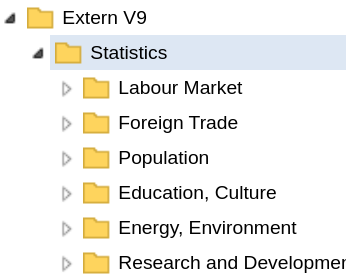

```{r, echo = FALSE}
source("R/setup.R")$value
```

```{r, include = FALSE}
if (!sc_key_exists())
  knitr::opts_chunk$set(eval = FALSE)
```

There are currently three functions in `r STATcubeR` that utilize the `/schema`
endpoint.

* `sc_schema_catalogue()` returns an overview of all available databases and tables.
* `sc_schema_db()` can be used to inspect all fields and measures for a database.
* `sc_schema()` returns metadata about any resource.

## Browsing the Catalogue

The first function shows the catalogue, which lists all available
databases in a tree form. The tree structure is determined by the API and
closely resembles the "Catalogue" view in the GUI.

```{r}
my_catalogue <- sc_schema_catalogue()
my_catalogue
```

We see that the catalog has 8 child nodes: Four childs of type `FOLDER` and four childs of type `TABLE`.
The table nodes correspond to the saved tables as described in the `r ticle("sc_table_saved")`.
The folders include all folders from the root level in the [catalogue explorer](`r sc_browse_catalogue()`):
"Statistics", "Publication and Services" as well as "Examples".

```{r,fig.align='center', out.width='70%', echo=FALSE}
knitr::include_graphics("img/catalogue2.png")
```

To get access to the child nodes use `my_catalogue${child_label}`

```{r, include = FALSE}
options(tibble.print_min = 5)
options(tibble.print_max = 5)
```

```{r}
my_catalogue$Statistics
```

The child node `Statistics` is also of class `sc_schema` and shows all entries of the subfolder.

```{r,fig.align='center', out.width='70%', echo=FALSE}

```

This syntax can be used to navigate through folders and subfolders.

```{r}
my_catalogue$Statistics$`Foreign Trade`
```

```{r,fig.align='center', out.width='70%', echo=FALSE}
knitr::include_graphics("img/catalogue4.png")
```

In some cases, the API shows more folders than the GUI in which case the folders from the API will be empty.

```{r}
my_catalogue$Statistics$`Foreign Trade`$Außenhandelsindizes
```

## Databases and Tables

Inside the catalogue, the leafs^[In the context of tree-like data structures, leafs are used to describe nodes of a tree which have no child nodes] of the tree are mostly of type `DATABASE` and `TABLE`.
Here is an example for the `DATABASE` node [`deake005`](`r sc_browse_database("deake005")`).

```{r}
my_catalogue$Statistics$`Labour Market`$`Working hours (Labour Force Survey)`
```

```{r,fig.align='center', out.width='70%', echo=FALSE}
knitr::include_graphics("img/catalogue_deake005.png")
```

The function `sc_schema_db()` will be shown in the next section.
As an example for a `TABLE` node, consider the [default table for `deake005`](`r STATcubeR:::sc_browse_table("defaulttable_deake005")`).

```{r}
my_catalogue$Statistics$`Labour Market`$
  `Standardtabelle / Default table (defaulttable_deake005)`
```

```{r,fig.align='center', out.width='70%', echo=FALSE}
knitr::include_graphics("img/catalogue_deake005_tables.png")
```

As suggested by the output, tables can be loaded with the `/table` endpoint via `sc_table_saved()`.
See the `r ticle("sc_table_saved")` for more details.

## Database Infos

To get information about a specific database, you can pass the database `id` to `sc_schema_db()`.
Similar to `sc_schema_catalogue()`, the return value has a tree-like data structure. 

```{r load_data}
my_db_info <- sc_schema_db("deake005")
my_db_info
```

For comparison, here is a screenshot from the sidebar of the table view for [`deake005`](`r sc_browse_database("deake005")`) which has a similar (but not identical) structure.

```{r,fig.align='center', out.width='70%', echo=FALSE}
knitr::include_graphics("img/table_view.png")
```

`my_db_info` can be used in a similar fashion as `my_catalogue`
to obtain details about the resources in the tree. For example, the
`VALUESET` with the label "Gender" can be viewed like this.

```{r}
my_db_info$`Demographic Characteristics`
my_db_info$`Demographic Characteristics`$Gender$Gender
my_db_info$`Demographic Characteristics`$Gender$Gender$male
```

The leafs of database schemas are mostly of type `VALUE` and `MEASURE`.

## Data Structure of sc_schema Objects

As shown above, `sc_schema` objets have a tree like structure.
Each `sc_schema` object has `id`, `label`, `location` and `type` as the last four entries

```{r}
str(tail(my_db_info$`Demographic Characteristics`, 4))
str(tail(my_catalogue$Statistics, 4))
```

Schema objects can have an arbitrary amount of children.
Children are always of type `sc_schema`.
`x$type` contains the type of the schema object.
A complete list of schema types is avilable in the [API reference](https://docs.wingarc.com.au/superstar/9.12/open-data-api/open-data-api-reference/schema-endpoint).

## Other Resources

Information about resources other than databases and the catalogue can
be obtained by passing the resource id to `sc_schema()`.

```{r}
(id <- my_db_info$Factors$id)
group_info <- sc_schema(id)
group_info
```

Note that the tree returned only has depth 1, i.e. the child nodes of measures are not available in `group_info`. 
However, ids of the child nodes can be obtained with `$id`.
These ids can be used to send another request to the `/schema` endpoint

```{r}
(id <- group_info$`Average hours usually worked per week`$id)
measure_info <- sc_schema(id)
```

Alternatively, use the `depth` parameter of `sc_schema`.
This will make sure that the enties of the tree are returned recursively up to the a certain level level.
For example, `depth = "VALUESET"` will use the same level of recursion as `sc_schema_db()`.
See `?sc_schema` for all available options of the `depth` parameter.

```{r}
group_info <- my_db_info$`Demographic Characteristics`$id %>%
  sc_schema(depth = "valueset")
```

## Printing with data.tree

If the `{data.tree}` package is installed, it can be used for an alternative
print mehtod.

```{r}
print(group_info, tree = TRUE)
```

The `{data.tree}` implementation of the print method can be set as a default using the option `STATcubeR.print_tree`

```{r}
options(STATcubeR.print_tree = TRUE)
```

## Flatten a Schema

The function `sc_schema_flatten()` can be used to turn responses from the `/schema` endpoint into `data.frame`s.
The following call extracts all databasess from the catalogue and displays their ids and labels.

```{r}
sc_schema_catalogue() %>%
  sc_schema_flatten("DATABASE")
```

The string `"DATABASE"` in the previous example acts as a filter to make sure only nodes with the schema type `DATABASE` are included in the table.

If `"DATABASE"` is relaced with `"TABLE"`, all tables will be displayed. This includes

* All the defaulttables on STATcube.
  Most databases have an associated default table.
* All saved tables for the current user as described in the `r ticle("sc_table_saved")`.
* Other saved tables.
  Some databases do not only provide a default table but also several other tables.
  See [this database on transport statistics](https://portal.statistik.at/statistik.at/ext/statcube/openinfopage?id=degvk_fahrt_2010) as an example for database with more than one associated table


```{r}
sc_schema_catalogue() %>%
  sc_schema_flatten("TABLE")
```

`sc_schema_flatten()` can also be used with `sc_schema_db()` and `sc_schema()`.
The following example shows all available measures from the [economic trend monitor database](https://portal.statistik.at/statistik.at/ext/statcube/openinfopage?id=dekonjunkturmonitor).

```{r}
sc_schema_db("dekonjunkturmonitor") %>%
  sc_schema_flatten("MEASURE")
```
