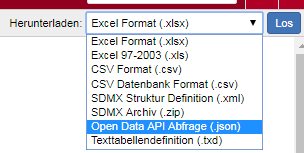

```{r, echo = FALSE}
source("R/setup.R")$value
```

```{r, include = FALSE}
if (!sc_key_exists())
  knitr::opts_chunk$set(eval = FALSE)
```

In the following example, a table will be exported from STATcube into an
R session. This process involves four steps

* create a table with the STATcube GUI (table view)
* download an "API request" for the table (format: `*.json`).
* send the `json` file to the API using `sc_table()`.
* convert the return value into a `data.frame`

It is assumed that you already provided your API key as described in the `r ticle("sc_key")`.

## Create a table with the STATcube GUI

Use the graphical user interface of STATcube to create a table. Visit
[STATcube] and select a database. This will open the table view where you can 
create a table. See the [STATcube manual] for details.

## Download an API request

Choose "Open Data API Abfrage (.json)" in the [download options]. This will
save a json file on your local file system.

 
 
It might be the case that this download option is not listed as a download format.
This means that the current user is not permitted to use the API.

## Send the json to the API

Provide the path to the downloaded json file as a string in `sc_table()`.

``` r
my_table <- sc_table(json_file = "path/to/api_request.json")
```

This will send the json-request to the [`/table` endpoint] of the API and return an object of class `sc_table`.
We will demonstrate this with an example json via `sc_example()`.
 
```{r, results='hide'}
(json_path <- sc_example("population_timeseries.json"))
## [1] "~/R/3.6/STATcubeR/json_examples/population_timeseries.json"
my_table <- sc_table(json_path)
```

Printing the object `my_table` will summarize the data contained in the response.

```{r}
my_table
```

## Convert the response into a data frame

The return value of `sc_table()` can be converted into a `data.frame` with `as.data.frame()`.

```{r}
as.data.frame(my_table)
```

This will produce a `data.frame`, which contains a column for each classification field of the table.
Furthermore, one column will be present for each measure.
In other words, the data uses a long format.
If you prefer to use codes rather than labels, use `my_table$data` instead.

```{r}
my_table$data
```

## Further reading

* Functionalities of the returned object are explained in the `r ticle("sc_data")`.
* `sc_tabulate()`  provides a more flixble way of turning STATcube tables into
  `data.frame`s. See the `r ticle("sc_tabulate")` for more details.
* The `r ticle("sc_table_saved")` shows an alternative way of importing tables.
* If you are interested in other API endpoints, see the `r ticle("sc_schema")`
  ot the `r ticle("sc_info")`

[`/table` endpoint]: https://docs.wingarc.com.au/superstar/9.12/open-data-api/open-data-api-reference/table-endpoint
[download options]: https://docs.wingarc.com.au/superstar/9.12/superweb2/user-guide/download-tables
[STATcube]: https://statcube.at/statcube/home
[STATcube manual]: http://www.statistik.at/wcm/idc/idcplg?IdcService=GET_PDF_FILE&dDocName=105692
